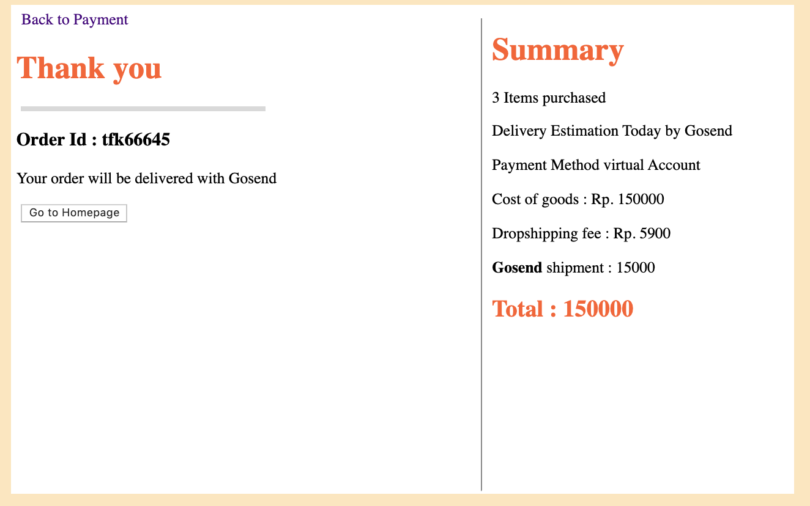

# jakmall_test

## Project setup
```
npm install
```

### Compiles and hot-reloads for development
```
npm run serve
```

### Project Preview

#### 1. Cart 
In This page, User will select desire amount of product by clicking + or - button. The product Quantity will update as well as total price. I add an alert if quantity is > 10 and < 0. 

Issue : 

1. The design still very simple and not as expected


#### 1. Delivery

In This Page, the amount product and total price will received. I done it wit Bus.Event. 

Issue : 

1. The design is not as expected
2. Form validation like : email, max character still not function
3. Sometime the data are ot receive directly from cart. must back again then trigger again with purchase


#### 1. Payment and Shiping


In this page I using @click.one for Shiping option. by that the button only can click once. 

Issue :

1. The design and button effect if clicked still not available
2. due to @click.once. cannot move to another button which already clicked in first place, then the state will update for the last button clicked
3. Sometime the data are not receive directly from delivery. must back again then trigger again with purchase


#### 1. Finish

This the last Page I built. In this page we can see in the summary for all the data that we fill in page before. 

1. The design still not as expected
3. Sometime the data are not receive directly from delivery. must back again then trigger again with purchase
4. The Automatic id still not available
5. Back Homepage button still not refreshing all the state from cart - payment




